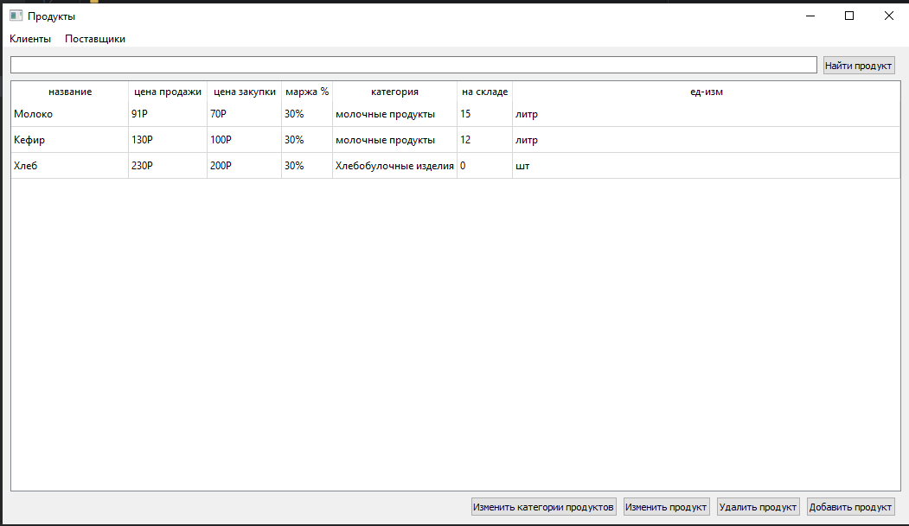
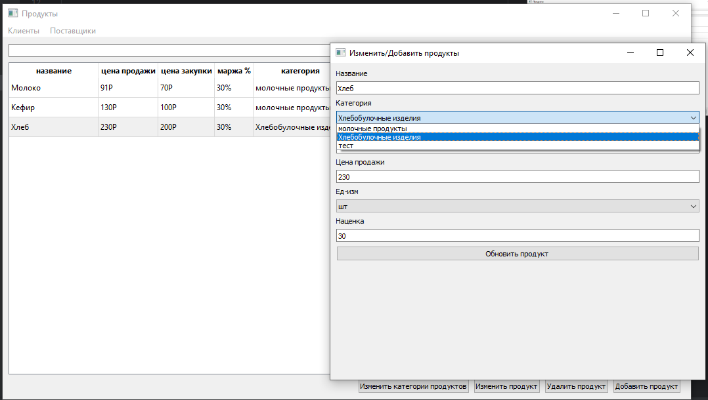
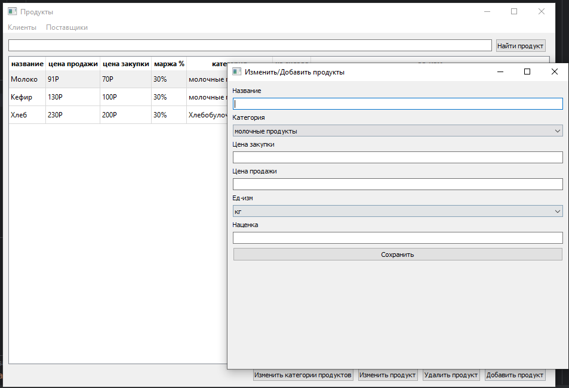
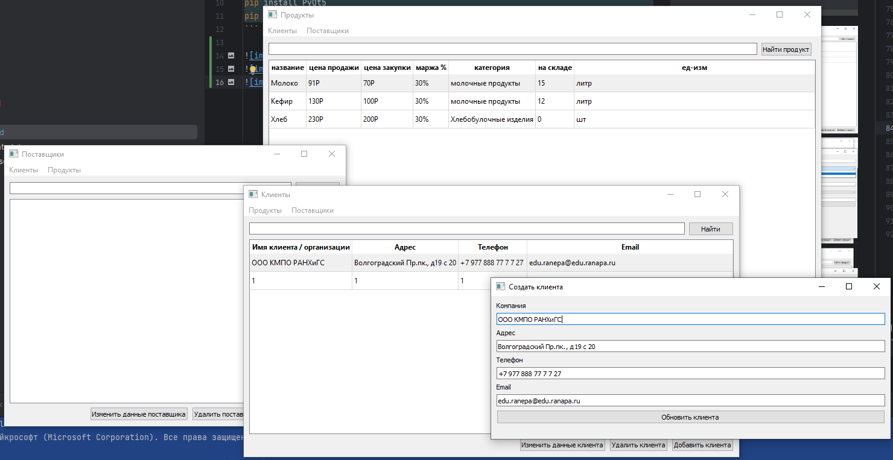

```shell
python -m venv venv # создаем виртуальное окружение (желательно)
./venv/Scrits/activate # активируем виртуальное окружение
./venv/Scrits/Activate.ps1 # активируем виртуальное окружение (windows powershell)

+ после этого надо настроить python interpreterer в pycharm ide, 
поставить локальный из папки ./venv/Script/python.exe

# создает файл ./code_export.txt со всем 
# программным кодом проекта, можно выполнять 
# как в bash так и в powershell терминалах, 
# или напрямую из IDE нажав на зеленую стрелочку в файле
# или запустив файл через ПКМ
./code_export.sh 

rm -rf ./.git # удалить git

winget install Qt.Designer # скачиваем Qt.Designer одной командой

# остальной инструментарий (опционально)
deactivate
pip list -v
pip install -r requirements.txt
pip list
```

Перед запуском проекта необходимо выполнить `CREATE DATABASE название_бд;`

В файле [orm.py](orm.py) (5 строчка) указывается с какой базой данных приложение должно работать




